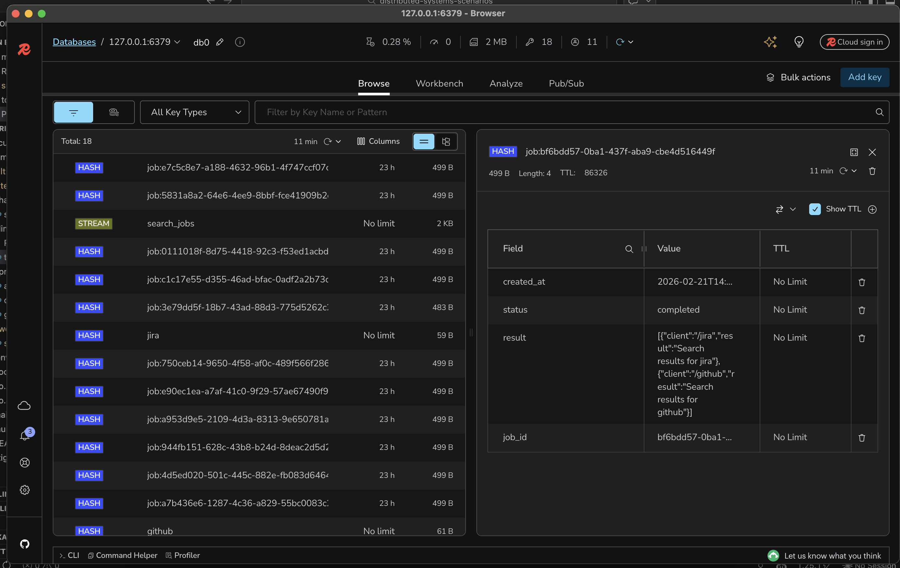

## Multi Api Rate Limiter

**How would we manage the scenario where the user needs to hit an api endpoint a thousand times but this endpoint consumes third party apis with different rate limiter each before assembling a response?**

In order to solve this, primarily a custom rate limiter has been designed following the token bucket algorithm depicted here. The idea is to simulate third party api endpoints in our own server and set custom rate limits for each.

To mimic this case we will have the following endpoints in place:

<table>
    <thead>
        <tr>
        <th>Verb</th><th>Resource</th><th>Description</th><th>Scope</th>
        </tr>
    </thead>
    <tbody>
        <tr>
            <td>GET</td><td>/github</td><td>Simulated third party github endpoint</td><td>Public</td>
        </tr>
        <tr>
            <td>GET</td><td>/jira</td><td>Simulated third party jira endpoint</td><td>Public</td>
        </tr>
        <tr>
            <td>GET</td><td>/search</td><td>Main route. Remember that the third party endpoints will be called from here</td><td>Public</td>
        </tr>
        <tr>
            <td>GET</td><td>/result/:job_id</td><td>Job results endpoint</td><td>Public</td>
        </tr>
    </tbody>
</table>


Since the api will be hit multiple times and the response will be delayed due to rate limit constraints an approach to address this would be by using asynchronous background jobs.

#### What do we need ?

- A way to persist background jobs ( a queue ) that will hold search jobs. A good way to implement a message queue is by using redis streams. Check the  the compose.yml file how a redis instance was created for this.

#### How is it going to work ?

As soon as the user issues an api call to the `GET /search` endpoint the backend will:

- Create a job id using the uuid package and a custom job key.
- Store in redis the following map message using a hash:

```go
map[string]interface{}{
    "status":     "pending",
    "job_id":     jobID,
    "created_at": time.Now().Format(time.RFC3339),
    "result":     nil,
}
```

Notice that result will eventually hold the api call's response. You can use [redis insight](https://redis.io/insight/) to see how the data is stored:



- Add the message to the stream with job id. In this case the stream name is **search_jobs** and we're simply storing the job id.
- Return the job id to the client so they call poll for results using the `GET /result/:job_id` endpoint.

There will be a background worker that is gonna run in a separate gorutine as soon as the server starts up. 

It will create the redis stream and a consumer group if it doesn't exist already and then it will read from the stream and check for results:

- If none of the third party api calls rate limit is exceeded then it will update the hash in redis and proceed to acknowledge the message so that it's removed from the stream:

```go
client.HSet(
    ctx,
    fmt.Sprintf("job:%s", jobID),
    map[string]interface{}{
        "status": "completed",
        "result": string(results),
    },
).Err()
...

client.XAck(ctx, "search_jobs", "job-workers", message.ID)
```

Otherwise, the process sleeps for a small period of time (seconds) before retrying.


