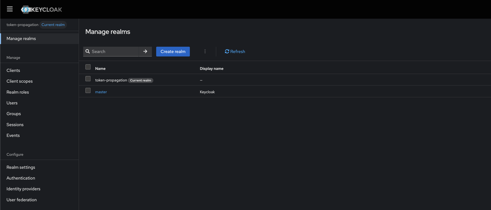
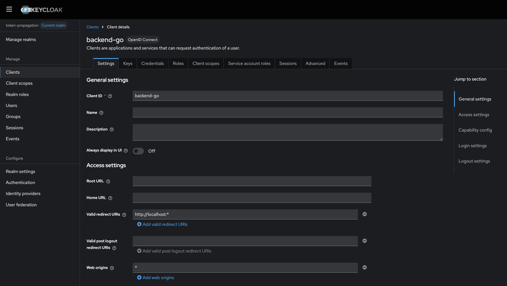
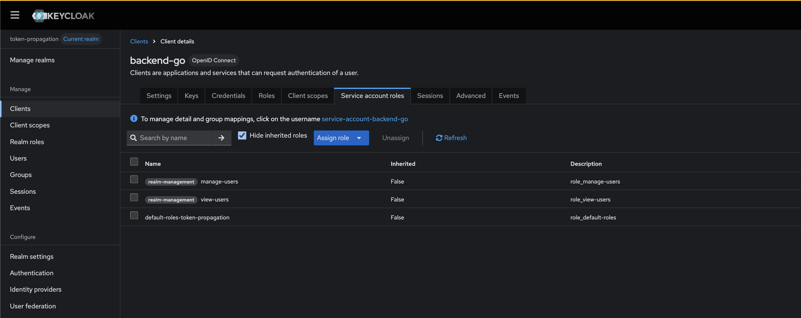
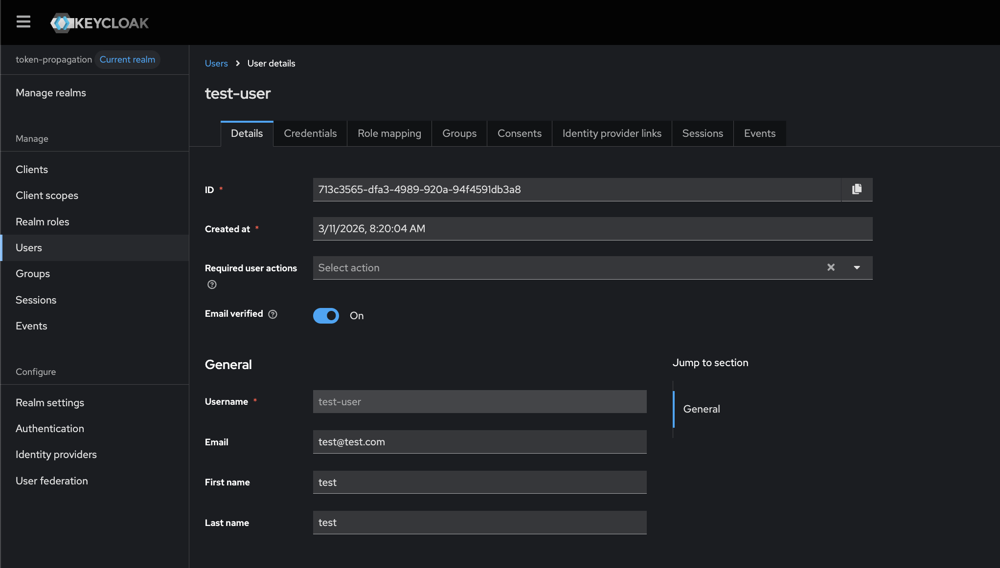

## Token Propagation

How would you handle the scenario where you have multiple microservices and you need to authenticate in order to access them ?

Ideally you would have an identity provider (IDP) that would hold the user base and would hand over an access token and provide a way to validate it.

In this case we're handling the scenario were we have a users and and a orders microservice. But in order to access any of them we need to have an entrypoint, a gateway. So these are the microservices we need for this example:

- gateway
- users
- orders

As for the identity provider we will be using keycloak.

#### Keycloak configuration

In order to configure keycloak properly, follow these steps:

1. Realm:

Head to the manage realm section and hit on create realm. You can name it whatever you want, I have named the realm as token-propagation.

2. Client:

The second step is to create a new client, so go to the clients section and hit on create client. I have chosen `backend-go` as the client id but you can name it as you please.

Make sure to configure it next this way:

- Client Authentication: On
- Service Accounts Roles: On
- Direct Access Grants: On

Save the changes, go to the credentials tab and make sure to copy the secret, you will need it to set the `KEYCLOAK_SECRET_KEY` env var.

3. Service Account Roles:

Once the client is created go to the service account roles tab, hit on assign role and select client roles. Then make sure to have selected the `view-users` and `manage-users` roles as displayed in the image below:

4. User:

Finally head to the users section and hit on add user. I have created one by entering the information shown in the image below. Make sure to go to the credentials tab, set the user's password and leave the temporary field as off.

#### How does it work ?

If you check closely the gateway service it has defined these endpoints:

POST /auth/login
POST /auth/refresh
GET /api/users
GET /api/orders

First we have created a test user manually in keycloak to speed up the process.
Typically we'd need to get a authentication token out of the /auth/login endpoint and of course we're going to authenticate with the test user we've just created.

When we authenticate keycloak generates a JWT token and signs it with it's private key. Once the user is authenticated and tries to hit protected endpoints a middleware based on echo-jwt would intercept every request to `/api/*`, extract the token out of the header and validate the token's signature using the public keys.

Now when microservice A communicates with microservice B it sends the token for microservice B to go through the same process: it asks keycloak to validate the token using it's public key.
